# Execution Plan — Vending Machine Demo

## Detailed Analysis Summary

### Change Impact Assessment
- **User-facing changes**: Yes — entirely new application with two distinct UIs (laptop 3D, mobile catalog)
- **Structural changes**: Yes — new full-stack architecture (React + Node.js + WebSocket + Docker)
- **Data model changes**: Yes — product inventory model, availability state, session management
- **API changes**: Yes — new REST endpoints + WebSocket events for real-time sync
- **NFR impact**: Yes — performance (WebSocket latency), security (HTTPS, headers), deployment (Docker/EC2)

### Risk Assessment
- **Risk Level**: Medium (multiple components, real-time sync complexity, 3D rendering)
- **Rollback Complexity**: Easy (greenfield, Docker-based, simple redeploy)
- **Testing Complexity**: Moderate (WebSocket testing, multi-device interaction, QR scanning)

## Workflow Visualization

```mermaid
flowchart TD
    Start(["User Request"])
    
    subgraph INCEPTION["INCEPTION PHASE"]
        WD["Workspace Detection<br/>COMPLETED"]
        RA["Requirements Analysis<br/>COMPLETED"]
        US["User Stories<br/>COMPLETED"]
        WP["Workflow Planning<br/>COMPLETED"]
        AD["Application Design<br/>EXECUTE"]
    end
    
    subgraph CONSTRUCTION["CONSTRUCTION PHASE"]
        FD["Functional Design<br/>EXECUTE"]
        NFRA["NFR Requirements<br/>EXECUTE"]
        NFRD["NFR Design<br/>EXECUTE"]
        ID["Infrastructure Design<br/>EXECUTE"]
        CG["Code Generation<br/>EXECUTE"]
        BT["Build and Test<br/>EXECUTE"]
    end
    
    Start --> WD
    WD --> RA
    RA --> US
    US --> WP
    WP --> AD
    AD --> FD
    FD --> NFRA
    NFRA --> NFRD
    NFRD --> ID
    ID --> CG
    CG --> BT
    BT --> End(["Complete"])
    
    style WD fill:#4CAF50,stroke:#1B5E20,stroke-width:3px,color:#fff
    style RA fill:#4CAF50,stroke:#1B5E20,stroke-width:3px,color:#fff
    style US fill:#4CAF50,stroke:#1B5E20,stroke-width:3px,color:#fff
    style WP fill:#4CAF50,stroke:#1B5E20,stroke-width:3px,color:#fff
    style AD fill:#FFA726,stroke:#E65100,stroke-width:3px,stroke-dasharray: 5 5,color:#000
    style FD fill:#FFA726,stroke:#E65100,stroke-width:3px,stroke-dasharray: 5 5,color:#000
    style NFRA fill:#FFA726,stroke:#E65100,stroke-width:3px,stroke-dasharray: 5 5,color:#000
    style NFRD fill:#FFA726,stroke:#E65100,stroke-width:3px,stroke-dasharray: 5 5,color:#000
    style ID fill:#FFA726,stroke:#E65100,stroke-width:3px,stroke-dasharray: 5 5,color:#000
    style CG fill:#4CAF50,stroke:#1B5E20,stroke-width:3px,color:#fff
    style BT fill:#4CAF50,stroke:#1B5E20,stroke-width:3px,color:#fff
    style INCEPTION fill:#BBDEFB,stroke:#1565C0,stroke-width:3px,color:#000
    style CONSTRUCTION fill:#C8E6C9,stroke:#2E7D32,stroke-width:3px,color:#000
    style Start fill:#CE93D8,stroke:#6A1B9A,stroke-width:3px,color:#000
    style End fill:#CE93D8,stroke:#6A1B9A,stroke-width:3px,color:#000
    
    linkStyle default stroke:#333,stroke-width:2px
```



### Text Alternative
```
Phase 1: INCEPTION
- Workspace Detection (COMPLETED)
- Requirements Analysis (COMPLETED)
- User Stories (COMPLETED)
- Workflow Planning (COMPLETED)
- Application Design (EXECUTE)

Phase 2: CONSTRUCTION (Single Unit)
- Functional Design (EXECUTE)
- NFR Requirements (EXECUTE)
- NFR Design (EXECUTE)
- Infrastructure Design (EXECUTE)
- Code Generation (EXECUTE)
- Build and Test (EXECUTE)
```

## Phases to Execute

### INCEPTION PHASE
- [x] Workspace Detection (COMPLETED)
- [x] Requirements Analysis (COMPLETED)
- [x] User Stories (COMPLETED)
- [x] Workflow Planning (COMPLETED)
- [ ] Application Design - **EXECUTE**
  - **Rationale**: New multi-component system (frontend, backend, WebSocket server, Docker services). Need to define component boundaries, service interfaces, and dependencies.
- [ ] Units Generation - **SKIP**
  - **Rationale**: This is a single cohesive application (not a microservices system). Frontend, backend, and infrastructure are tightly coupled for this demo. A single unit of work is appropriate.

### CONSTRUCTION PHASE (Single Unit: "vending-machine-demo")
- [ ] Functional Design - **EXECUTE**
  - **Rationale**: Business logic for product state management, QR generation/regeneration, auto-reset timer, and real-time sync needs detailed design. PBT-01 requires property identification.
- [ ] NFR Requirements - **EXECUTE**
  - **Rationale**: Security (HTTPS, headers, rate limiting), performance (WebSocket latency), and tech stack finalization. PBT-09 requires framework selection.
- [ ] NFR Design - **EXECUTE**
  - **Rationale**: Need to incorporate security headers, structured logging, rate limiting patterns, health checks, and WebSocket connection management into the design.
- [ ] Infrastructure Design - **EXECUTE**
  - **Rationale**: AWS EC2 deployment, Docker Compose orchestration, HTTPS/TLS setup, CI/CD pipeline definition needed.
- [ ] Code Generation - **EXECUTE** (ALWAYS)
  - **Rationale**: Full implementation — React + Three.js frontend, Node.js + Express + Socket.IO backend, Docker configuration, CI/CD pipeline.
- [ ] Build and Test - **EXECUTE** (ALWAYS)
  - **Rationale**: Build instructions, unit tests (with PBT), integration tests, and deployment verification.

### OPERATIONS PHASE
- [ ] Operations - **PLACEHOLDER**
  - **Rationale**: Future expansion. Build and test instructions cover deployment for now.

## Success Criteria
- **Primary Goal**: Working Vending Machine Demo accessible via public URL
- **Key Deliverables**:
  - 3D/animated vending machine UI (laptop browser)
  - QR code scanning workflow (phone)
  - Real-time WebSocket synchronization
  - Docker Compose deployment configuration
  - AWS EC2 deployment instructions
  - CI/CD pipeline (GitHub Actions)
  - Comprehensive tests (example-based + property-based)
- **Quality Gates**:
  - All 15 SECURITY rules compliant (or N/A justified)
  - All 10 PBT rules compliant (or N/A justified)
  - Applicable RESILIENCY rules compliant (most N/A for demo)
  - WebSocket latency < 500ms
  - Page load < 3 seconds
  - QR regeneration < 1 second
